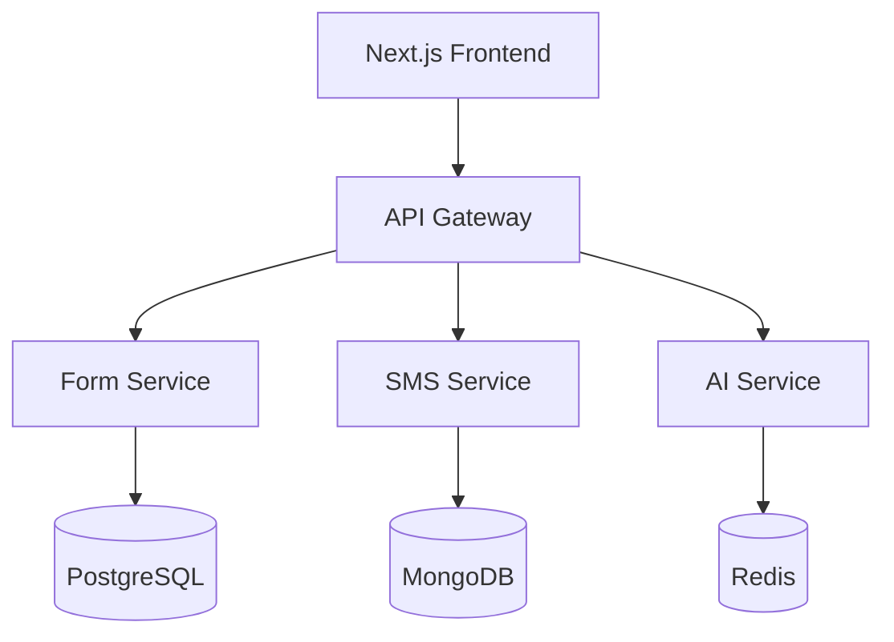

# AI-Driven Lead Capture & SMS Lead Nurturing Platform

[]
[]
[]


Enterprise-grade platform combining intelligent form capture with AI-powered SMS automation for seamless lead engagement and nurturing.

## 🚀 Key Features

- **Smart Lead Capture Forms**
  - Drag-and-drop form builder
  - Embeddable widgets
  - Real-time validation
  - Custom branding support

- **AI-Powered SMS Management**
  - Sub-500ms response time
  - Natural language processing
  - Context-aware conversations
  - Multi-provider SMS integration

- **Human Oversight Dashboard**
  - Real-time conversation monitoring
  - Instant takeover capabilities
  - Performance analytics
  - Team collaboration tools

- **Enterprise Security**
  - SOC 2 certified
  - GDPR compliant
  - End-to-end encryption
  - Role-based access control

## 🏗 Architecture



- **Frontend**: Next.js 14 with SSR optimization
- **Backend**: Node.js 20 LTS microservices
- **AI Service**: Python 3.11 with FastAPI
- **Infrastructure**: AWS with multi-region support

## 🚦 Quick Start

### Prerequisites

- Node.js 20 LTS
- Python 3.11+
- Docker & Docker Compose
- AWS CLI configured

### Local Development Setup

1. Clone the repository with submodules:
```bash
git clone --recursive https://github.com/organization/ai-sms-lead-platform
cd ai-sms-lead-platform
```

2. Install dependencies:
```bash
# Frontend dependencies
cd src/web
npm install

# Backend dependencies
cd ../backend
npm install

# AI service dependencies
cd ../ai-service
python -m venv venv
source venv/bin/activate  # or `venv\Scripts\activate` on Windows
pip install -r requirements.txt
```

3. Configure environment:
```bash
cp .env.example .env
# Edit .env with your configuration
```

4. Start development environment:
```bash
docker-compose up -d
npm run dev
```

5. Verify installation:
```bash
npm run test
```

## 📁 Repository Structure

```
/
├── src/
│   ├── web/                 # Next.js frontend application
│   ├── backend/            # Node.js microservices
│   └── ai-service/         # Python AI service
├── infrastructure/         # Kubernetes & AWS configurations
├── docs/                   # Comprehensive documentation
└── scripts/               # Development & deployment scripts
```

## 🛠 Development

- **Code Style**: ESLint & Prettier configured
- **Testing**: Jest, Cypress, and Python unittest
- **CI/CD**: GitHub Actions with automated deployments
- **Documentation**: OpenAPI/Swagger specifications

## 🚀 Deployment

Detailed deployment guides available for:
- AWS EKS Production Setup
- Staging Environment
- Development Pipeline
- Monitoring & Logging

## 🔒 Security

- Zero-trust security model
- Regular security audits
- Automated vulnerability scanning
- Data encryption at rest and in transit

## 📊 Monitoring

- Prometheus metrics
- Grafana dashboards
- ELK stack for logging
- Real-time alerts

## 🔧 Troubleshooting

Common issues and solutions documented in [TROUBLESHOOTING.md](./docs/TROUBLESHOOTING.md)

## 🤝 Contributing

1. Fork the repository
2. Create feature branch
3. Commit changes
4. Push to branch
5. Open pull request

See [CONTRIBUTING.md](./CONTRIBUTING.md) for detailed guidelines.

## 📄 License

MIT License - see [LICENSE](./LICENSE) for details

## 🆘 Support

- **Issues**: [GitHub Issues](https://github.com/organization/ai-sms-lead-platform/issues)
- **Discussions**: [GitHub Discussions](https://github.com/organization/ai-sms-lead-platform/discussions)
- **Security**: security@organization.com
- **Documentation**: https://docs.organization.com

## 🏢 Compliance

- GDPR Compliant
- SOC 2 Certified
- Regular security audits
- Data privacy controls

---

Built with ❤️ by [Organization Name]