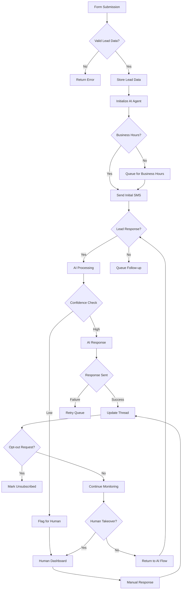
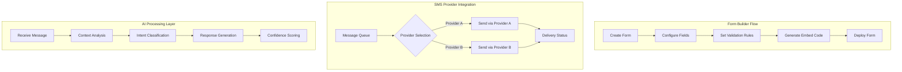
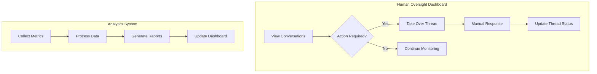
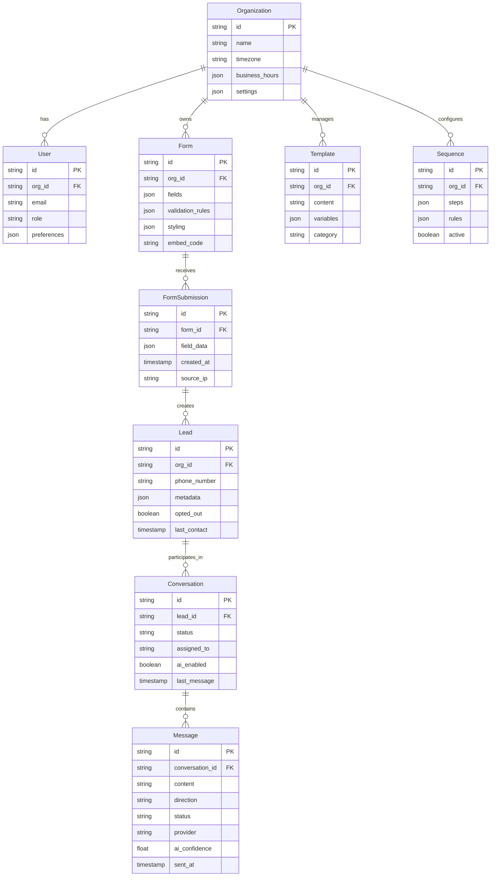
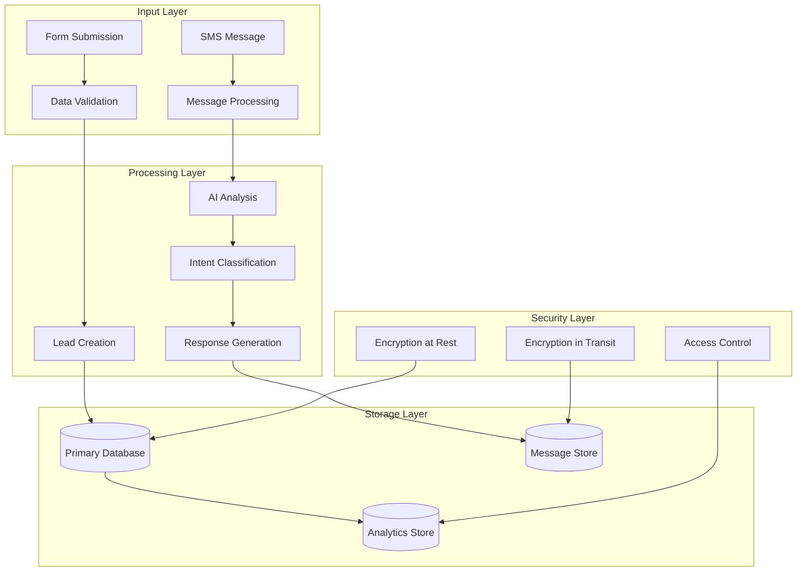
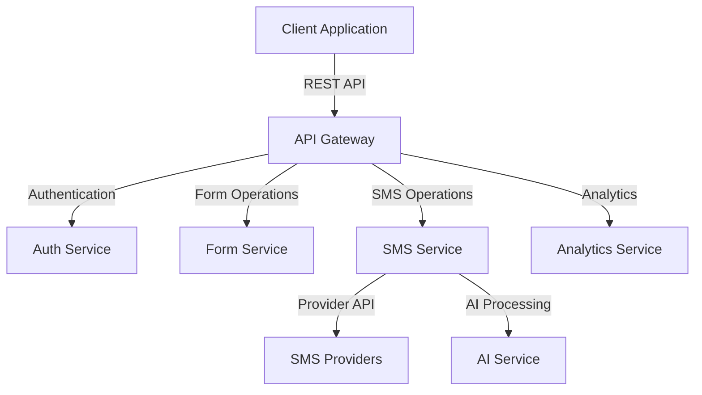

# Product Requirements Document (PRD)

# 1. INTRODUCTION

## 1.1 Purpose

This Software Requirements Specification (SRS) document provides a comprehensive description of the AI-Driven Lead Capture & SMS Lead Nurturing Platform. It details the functional and non-functional requirements for developers, project managers, QA teams, and stakeholders involved in the development and implementation process.

## 1.2 Scope

The platform integrates lead capture functionality with AI-powered SMS communication to create a unified lead nurturing solution. Key components include:

- Form Builder & Embedding System
  - Customizable lead capture forms
  - Embeddable widgets for websites
  - Form analytics and tracking

- AI-Powered SMS Communication
  - Automated conversation initiation
  - Natural language processing for responses
  - Intelligent routing and escalation
  - Multi-provider SMS integration

- Human Oversight Dashboard
  - Unified SMS inbox
  - Real-time conversation monitoring
  - Instant AI-to-human handoff
  - Performance analytics

- Automation Framework
  - Customizable SMS sequences
  - Business hours management
  - Template configuration
  - Compliance handling

The system will be built using Next.js for the frontend interface, with a provider-agnostic backend architecture supporting multiple SMS providers, and incorporating advanced AI capabilities for natural language processing and conversation management.

# 2. PRODUCT DESCRIPTION

## 2.1 Product Perspective

The AI-Driven Lead Capture & SMS Lead Nurturing Platform operates as a standalone SaaS solution that integrates with existing business systems through:

- Website integration via embeddable form widgets
- SMS provider infrastructure connections
- CRM system integrations for lead data synchronization
- AI/LLM service integration for natural language processing

The system architecture follows a modular design with these key components:
- Form Builder Module
- SMS Communication Engine
- AI Processing Layer
- Human Oversight Interface
- Analytics & Reporting System

## 2.2 Product Functions

The platform provides these primary functions:

1. Lead Capture Management
   - Form creation and customization
   - Widget embedding system
   - Form submission processing
   - Lead data validation and storage

2. AI-Powered Communication
   - Automated conversation initiation
   - Natural language message processing
   - Context-aware response generation
   - Conversation flow management

3. SMS Operations
   - Provider-agnostic message handling
   - Queue management
   - Delivery status tracking
   - Multi-threaded conversation handling

4. Human Oversight
   - Real-time conversation monitoring
   - AI-to-human handoff
   - Manual message sending
   - Conversation history access

5. Automation Management
   - Sequence creation and editing
   - Business hours configuration
   - Template management
   - Compliance rule setting

## 2.3 User Characteristics

Primary Users:
1. Sales Representatives
   - Technical Level: Intermediate
   - Usage Frequency: Daily
   - Key Needs: Quick access to conversations, easy handoff from AI

2. Sales Managers
   - Technical Level: Intermediate to Advanced
   - Usage Frequency: Daily/Weekly
   - Key Needs: Performance monitoring, template management

3. System Administrators
   - Technical Level: Advanced
   - Usage Frequency: Weekly/Monthly
   - Key Needs: System configuration, user management

4. Marketing Teams
   - Technical Level: Intermediate
   - Usage Frequency: Weekly
   - Key Needs: Form creation, automation setup

## 2.4 Constraints

1. Technical Constraints
   - SMS provider rate limits
   - AI processing latency requirements (<500ms)
   - Real-time synchronization needs
   - Mobile device compatibility requirements

2. Regulatory Constraints
   - TCPA compliance for SMS marketing
   - GDPR and CCPA data privacy requirements
   - Industry-specific communication regulations
   - Data retention policies

3. Operational Constraints
   - Business hours handling
   - Message queue capacity
   - Concurrent user limits
   - Storage limitations

## 2.5 Assumptions and Dependencies

Assumptions:
1. Users have stable internet connectivity
2. Lead volume follows predicted patterns
3. AI service maintains consistent availability
4. SMS providers maintain reliable service levels

Dependencies:
1. External Services
   - SMS provider APIs
   - AI/LLM service availability
   - Cloud infrastructure uptime
   - Third-party authentication services

2. Technical Dependencies
   - Next.js framework compatibility
   - Database scalability
   - Message queue performance
   - AI model updates

3. Business Dependencies
   - SMS provider contracts
   - AI service licensing
   - Technical support availability
   - User training resources

# 3. PROCESS FLOWCHART

# 4. FUNCTIONAL REQUIREMENTS

## 4.1 Form Builder & Embedding System

### ID: F-100
### Description: System for creating, customizing, and embedding lead capture forms
### Priority: High
### Requirements:

| ID | Requirement | Priority |
|---|---|---|
| F-101 | Drag-and-drop form builder interface with common field types (text, email, phone, etc.) | High |
| F-102 | Form validation rules configuration (required fields, format validation) | High |
| F-103 | Custom styling options (colors, fonts, spacing) matching client branding | Medium |
| F-104 | Generate embeddable widget code for website integration | High |
| F-105 | Form analytics tracking (views, submissions, completion rate) | Medium |
| F-106 | Mobile-responsive form layouts | High |
| F-107 | Multi-page form support with conditional logic | Low |

## 4.2 AI-Powered SMS Communication

### ID: F-200
### Description: Natural language processing and automated SMS conversation management
### Priority: High
### Requirements:

| ID | Requirement | Priority |
|---|---|---|
| F-201 | Automated message initiation based on form submission | High |
| F-202 | Natural language understanding of incoming messages | High |
| F-203 | Context-aware response generation (<500ms latency) | High |
| F-204 | Sentiment analysis for conversation monitoring | Medium |
| F-205 | Intent classification for routing decisions | High |
| F-206 | Multi-language support | Low |
| F-207 | Learning from human agent responses | Medium |

## 4.3 Human Oversight Dashboard

### ID: F-300
### Description: Interface for monitoring and managing SMS conversations
### Priority: High
### Requirements:

| ID | Requirement | Priority |
|---|---|---|
| F-301 | Unified inbox showing all conversations | High |
| F-302 | Real-time conversation monitoring with AI confidence scores | High |
| F-303 | One-click AI-to-human handoff | High |
| F-304 | Conversation search and filtering | Medium |
| F-305 | Quick response templates | Medium |
| F-306 | Dark/light mode toggle | Low |
| F-307 | Mobile-responsive dashboard interface | High |

## 4.4 Automation Framework

### ID: F-400
### Description: Tools for managing automated messaging sequences and rules
### Priority: High
### Requirements:

| ID | Requirement | Priority |
|---|---|---|
| F-401 | Visual sequence builder for automated messages | High |
| F-402 | Business hours configuration by timezone | High |
| F-403 | Template management system with variables | High |
| F-404 | Compliance rule configuration (opt-out handling) | High |
| F-405 | Delay and wait step configuration | Medium |
| F-406 | A/B testing capabilities for sequences | Low |
| F-407 | Sequence performance analytics | Medium |

## 4.5 SMS Provider Integration

### ID: F-500
### Description: Provider-agnostic SMS sending and receiving system
### Priority: High
### Requirements:

| ID | Requirement | Priority |
|---|---|---|
| F-501 | Multi-provider message routing | High |
| F-502 | Queue management for reliable delivery | High |
| F-503 | Delivery status tracking and reporting | High |
| F-504 | Automatic failover between providers | Medium |
| F-505 | Message cost optimization | Medium |
| F-506 | Provider-specific configuration management | High |
| F-507 | Message threading and conversation tracking | High |

# 5. NON-FUNCTIONAL REQUIREMENTS

## 5.1 Performance Requirements

| Requirement | Specification |
|------------|---------------|
| Response Time | - Web dashboard loading: < 2 seconds |
| | - AI message processing: < 500ms |
| | - Form submission processing: < 1 second |
| | - SMS delivery initiation: < 2 seconds |
| Throughput | - Support 1000 concurrent users |
| | - Handle 100,000 SMS messages per hour |
| | - Process 10,000 form submissions per hour |
| Resource Usage | - Maximum 2GB RAM per server instance |
| | - CPU utilization < 80% under peak load |
| | - Storage scaling up to 1TB per tenant |

## 5.2 Safety Requirements

| Requirement | Specification |
|------------|---------------|
| Data Backup | - Automated daily backups |
| | - Point-in-time recovery capability |
| | - Maximum 1-hour data loss tolerance |
| Failure Recovery | - Automatic failover for critical services |
| | - Self-healing infrastructure |
| | - Disaster recovery time < 4 hours |
| Error Handling | - Graceful degradation of services |
| | - Automated error logging and alerting |
| | - Circuit breakers for external dependencies |

## 5.3 Security Requirements

| Requirement | Specification |
|------------|---------------|
| Authentication | - Multi-factor authentication support |
| | - SSO integration capability |
| | - Password policy enforcement |
| Authorization | - Role-based access control (RBAC) |
| | - Granular permission management |
| | - API key management |
| Data Protection | - At-rest encryption using AES-256 |
| | - In-transit encryption using TLS 1.3 |
| | - End-to-end encryption for sensitive data |
| Privacy | - Data anonymization capabilities |
| | - Configurable data retention policies |
| | - GDPR compliance tools |

## 5.4 Quality Requirements

### 5.4.1 Availability
- System uptime: 99.9% (excluding planned maintenance)
- Maximum planned downtime: 4 hours per month
- Redundancy across multiple availability zones

### 5.4.2 Maintainability
- Modular architecture with clear separation of concerns
- Comprehensive API documentation
- Automated deployment pipeline
- Code coverage minimum 80%

### 5.4.3 Usability
- Mobile-responsive design for all interfaces
- WCAG 2.1 Level AA compliance
- Maximum 3 clicks to reach any feature
- Support for multiple languages
- Dark/light mode support

### 5.4.4 Scalability
- Horizontal scaling capability
- Auto-scaling based on load
- Multi-tenant architecture
- Database sharding support
- Microservices-based design

### 5.4.5 Reliability
- Zero data loss guarantee
- Message delivery guarantee
- Automated system health checks
- Fault tolerance for third-party service outages

## 5.5 Compliance Requirements

| Requirement | Specification |
|------------|---------------|
| SMS Regulations | - TCPA compliance |
| | - CAN-SPAM Act compliance |
| | - Automated opt-out handling |
| Data Privacy | - GDPR compliance |
| | - CCPA compliance |
| | - Data sovereignty support |
| Industry Standards | - ISO 27001 compliance |
| | - SOC 2 Type II certification |
| | - OWASP security standards |
| Documentation | - Compliance audit trails |
| | - Regular security assessments |
| | - Privacy policy management |

# 6. DATA REQUIREMENTS

## 6.1 Data Models

## 6.2 Data Storage

### 6.2.1 Primary Storage
- PostgreSQL for relational data (organizations, users, forms, leads)
- MongoDB for conversation/message history and form submissions
- Redis for caching and real-time data

### 6.2.2 Data Retention
| Data Type | Retention Period | Storage Type |
|-----------|-----------------|--------------|
| Form Submissions | 90 days | Hot Storage |
| Messages | 2 years | Tiered Storage |
| Lead Data | 5 years | Hot/Cold Storage |
| Analytics Data | 1 year | Data Warehouse |
| System Logs | 30 days | Log Storage |

### 6.2.3 Backup & Recovery
- Automated daily snapshots with 30-day retention
- Point-in-time recovery capability within 7 days
- Cross-region backup replication
- Maximum 15-minute Recovery Point Objective (RPO)
- 4-hour Recovery Time Objective (RTO)

## 6.3 Data Processing

### 6.3.1 Data Security
- Field-level encryption for PII
- TLS 1.3 for data in transit
- AES-256 encryption at rest
- Role-based access control (RBAC)
- Data masking for sensitive fields
- Audit logging of all data access

### 6.3.2 Data Processing Rules
| Process | Rule | Priority |
|---------|------|----------|
| Lead Deduplication | Match on phone number and email | High |
| Message Queueing | Max 3 retry attempts | High |
| Data Validation | Required field checks | High |
| AI Processing | Max 500ms processing time | High |
| Analytics Processing | Batch processing every 5 minutes | Medium |

### 6.3.3 Data Integration
- REST APIs for external system integration
- Webhook support for real-time events
- Batch import/export capabilities
- ETL pipelines for analytics data
- Real-time sync with SMS providers

# 7. EXTERNAL INTERFACES

## 7.1 User Interfaces

### 7.1.1 Web Dashboard Interface

| Component | Requirements |
|-----------|--------------|
| Form Builder | - Drag-and-drop interface with live preview |
| | - Field property configuration panel |
| | - Mobile/desktop preview toggle |
| | - Theme customization controls |
| SMS Inbox | - Threaded conversation view |
| | - Real-time message updates |
| | - AI confidence indicator |
| | - Quick action toolbar |
| Analytics Dashboard | - Customizable widget layout |
| | - Interactive data visualizations |
| | - Date range selector |
| | - Export capabilities |

### 7.1.2 Mobile Interface

| Component | Requirements |
|-----------|--------------|
| Responsive Design | - Fluid layouts for all screen sizes |
| | - Touch-optimized controls |
| | - Native-like scrolling |
| Mobile Navigation | - Bottom navigation bar |
| | - Swipe gestures |
| | - Pull-to-refresh |

## 7.2 Software Interfaces

### 7.2.1 SMS Provider Integration

| Provider Interface | Specifications |
|-------------------|----------------|
| Twilio | - REST API v2 |
| | - Webhook endpoints for status updates |
| | - Message queuing interface |
| MessageBird | - REST API v3 |
| | - Real-time status updates |
| | - Delivery reporting |

### 7.2.2 AI/LLM Integration

| Service | Interface Specifications |
|---------|------------------------|
| OpenAI API | - GPT-4 model access |
| | - Streaming response support |
| | - Rate limiting handling |
| Custom Models | - REST API endpoints |
| | - WebSocket for real-time inference |
| | - Model versioning support |

### 7.2.3 External System Integration

| System | Interface Type |
|--------|---------------|
| CRM Systems | - REST API endpoints |
| | - Webhook support |
| | - OAuth 2.0 authentication |
| Analytics Platforms | - Event streaming API |
| | - Batch data export |
| | - Real-time metrics push |

## 7.3 Communication Interfaces

### 7.3.1 Network Protocols

| Protocol | Specification |
|----------|---------------|
| HTTP/HTTPS | - TLS 1.3 minimum |
| | - REST API compliance |
| | - Rate limiting |
| WebSocket | - Secure WebSocket (WSS) |
| | - Heartbeat mechanism |
| | - Auto-reconnection |

### 7.3.2 Data Formats

| Format | Usage |
|--------|--------|
| JSON | - API requests/responses |
| | - Configuration data |
| | - Message payload |
| Protocol Buffers | - High-throughput data exchange |
| | - Real-time messaging |
| CSV | - Data export/import |
| | - Bulk operations |

### 7.3.3 API Specifications

# 8. APPENDICES

## 8.1 GLOSSARY

| Term | Definition |
|------|------------|
| Lead Capture | The process of collecting potential customer information through forms or other input methods |
| Lead Nurturing | The process of developing relationships with buyers at every stage of the sales funnel |
| Form Widget | An embeddable component that can be integrated into websites to collect user information |
| Thread | A continuous SMS conversation between the system and a lead |
| Sequence | A pre-defined series of automated messages sent based on triggers or schedules |
| Handoff | The process of transferring conversation control from AI to human agent |
| Provider-agnostic | System architecture that can work with multiple SMS service providers |
| Dark/Light Mode | User interface color schemes optimized for different lighting conditions |

## 8.2 ACRONYMS

| Acronym | Expansion |
|---------|-----------|
| AI | Artificial Intelligence |
| API | Application Programming Interface |
| CCPA | California Consumer Privacy Act |
| CRM | Customer Relationship Management |
| GDPR | General Data Protection Regulation |
| LLM | Large Language Model |
| PII | Personally Identifiable Information |
| RBAC | Role-Based Access Control |
| REST | Representational State Transfer |
| SMS | Short Message Service |
| SSO | Single Sign-On |
| TCPA | Telephone Consumer Protection Act |
| TLS | Transport Layer Security |
| UI | User Interface |
| WSS | WebSocket Secure |

## 8.3 ADDITIONAL REFERENCES

| Category | Reference |
|----------|-----------|
| SMS Compliance | - [TCPA Compliance Guide](https://www.fcc.gov/tcpa) |
| | - [CAN-SPAM Act Requirements](https://www.ftc.gov/tips-advice/business-center/guidance/can-spam-act-compliance-guide-business) |
| Technical Standards | - [Next.js Documentation](https://nextjs.org/docs) |
| | - [OpenAI API Reference](https://platform.openai.com/docs/api-reference) |
| | - [Twilio SMS API Guide](https://www.twilio.com/docs/sms) |
| Security Standards | - [OWASP Security Guidelines](https://owasp.org/www-project-web-security-testing-guide/) |
| | - [GDPR Requirements](https://gdpr.eu/requirements/) |
| Design Resources | - [WCAG 2.1 Guidelines](https://www.w3.org/WAI/WCAG21/quickref/) |
| | - [Material Design System](https://material.io/design) |