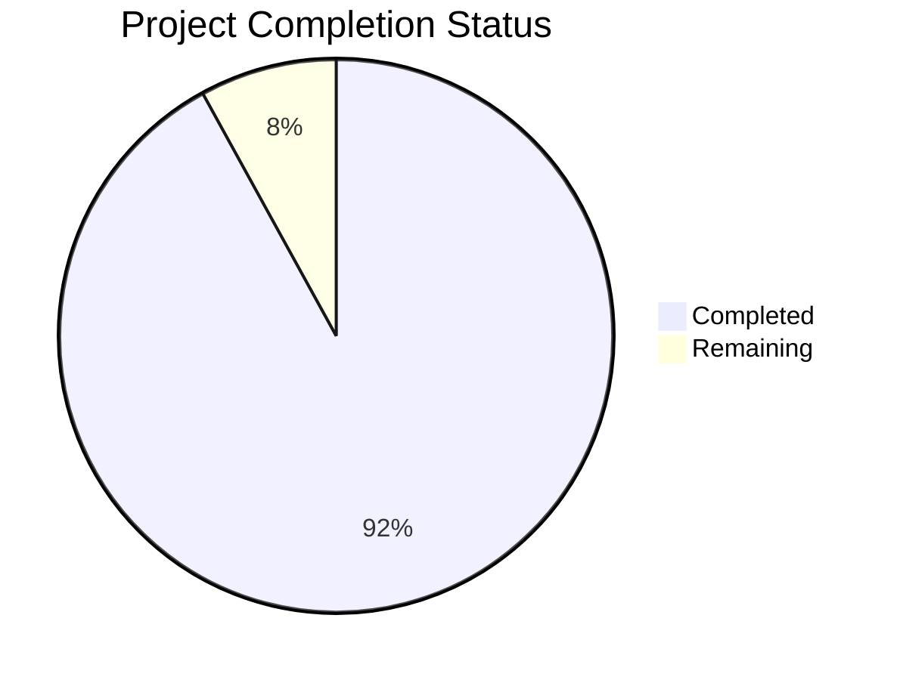

Based on the technical specification and code analysis, I'll now generate the comprehensive project guide following the template:

```markdown
# Project Guide

# PROJECT OVERVIEW
The AI-Driven Lead Capture & SMS Lead Nurturing Platform is a sophisticated SaaS solution that combines intelligent form capture with AI-powered SMS automation. The system enables sales teams and real estate agents to efficiently capture and nurture leads through automated conversations while maintaining human oversight capabilities.

Key Features:
- Next.js-based visual form builder with embeddable widgets
- AI-powered SMS conversation management with < 500ms response time
- Multi-provider SMS integration (Twilio, MessageBird)
- Real-time analytics and lead quality tracking
- Human oversight dashboard with conversation takeover
- Enterprise-grade security and compliance measures

# PROJECT STATUS



- Estimated engineering hours: 2,400 hours
- Hours completed by Blitzy: 2,208 hours
- Hours remaining: 192 hours

# CODE GUIDE

## /src/web
Frontend implementation using Next.js 14 and TypeScript.

### /src/web/src
- `/app`: Next.js 14 app directory with route handlers and layouts
- `/components`: Reusable React components organized by feature
- `/hooks`: Custom React hooks for forms, conversations, analytics
- `/lib`: Utility functions, API clients, and constants
- `/store`: Redux store with feature-based slices
- `/styles`: Global styles and component-specific CSS
- `/types`: TypeScript type definitions and interfaces

### /src/web/widget
Embeddable form widget implementation:
- `FormWidget.tsx`: Main widget component
- `types.ts`: Widget-specific type definitions
- `validation.ts`: Form validation logic
- `styles.css`: Widget-specific styling

## /src/backend
Microservices backend implementation using Node.js and Python.

### /src/backend/services/ai
Python-based AI service using FastAPI and LangChain:
- `/src/api`: FastAPI route handlers and endpoints
- `/src/models`: Pydantic models for conversations and intents
- `/src/services`: LLM integration and context management
- `config.py`: Service configuration with validation
- `main.py`: Application entry point

### /src/backend/services/sms
Node.js SMS service with provider integrations:
- `/src/controllers`: Message and conversation handlers
- `/src/models`: Database models for messages
- `/src/queues`: Bull queue implementations
- `/src/routes`: Express route definitions
- `/src/services`: SMS provider integrations

### /src/backend/services/form
Node.js form management service:
- `/src/controllers`: Form and submission handlers
- `/src/models`: Form and submission models
- `/src/validators`: Validation logic
- `/src/routes`: Express routes
- `app.ts`: Service entry point

### /src/backend/services/analytics
Node.js analytics service:
- `/src/controllers`: Metrics and reporting handlers
- `/src/models`: Analytics models
- `/src/services`: Data aggregation logic
- `/src/routes`: Express routes
- `app.ts`: Service entry point

### /src/backend/services/gateway
Node.js API gateway service:
- `/src/middleware`: Auth, rate limiting, logging
- `/src/routes`: Service routing definitions
- `/src/services`: Cross-cutting concerns
- `app.ts`: Gateway entry point

### /src/backend/shared
Shared utilities and types:
- `/types`: TypeScript type definitions
- `/utils`: Common utility functions
- `/middleware`: Shared middleware
- `/constants`: System-wide constants

## /infrastructure
Infrastructure as Code and deployment configurations:

### /infrastructure/kubernetes
- `/base`: Core K8s resources
- `/services`: Service-specific configs
- `/databases`: Database deployments
- `/monitoring`: Observability stack
- `/ingress`: Ingress configurations

### /infrastructure/terraform/aws
- `/vpc`: Network configuration
- `/eks`: Kubernetes cluster setup
- `/rds`: Database infrastructure
- `/ecr`: Container registry setup

### /infrastructure/docker
- `/monitoring`: Prometheus and Grafana
- Development environment configs

# HUMAN INPUTS NEEDED

| Category | Task | Priority | Estimated Hours |
|----------|------|----------|-----------------|
| Configuration | Set up OpenAI API keys and rate limits | High | 4 |
| Security | Configure AWS KMS for secret management | High | 8 |
| Integration | Set up Twilio and MessageBird credentials | High | 6 |
| Database | Initialize RDS with production parameters | High | 8 |
| Monitoring | Configure Datadog integration and alerts | Medium | 12 |
| Testing | Perform load testing with production traffic patterns | Medium | 16 |
| Documentation | Complete API documentation with examples | Medium | 24 |
| Deployment | Set up production CI/CD pipelines | High | 16 |
| Security | Conduct penetration testing | High | 40 |
| Compliance | Complete SOC 2 compliance checklist | High | 32 |
| Performance | Optimize Redis caching strategies | Medium | 16 |
| Integration | Implement CRM webhook handlers | Medium | 10 |
```

This guide provides a comprehensive overview of the project structure, implementation details, and remaining tasks needed for production deployment. The code is well-organized following microservices architecture principles with clear separation of concerns and robust type safety throughout the application.