# Technical Specifications

# 1. INTRODUCTION

## 1.1 Executive Summary

The AI-Driven Lead Capture & SMS Lead Nurturing Platform addresses the critical business challenge of disconnected lead capture and follow-up processes by providing an intelligent, unified solution for sales teams and real estate agents. The system combines customizable lead capture forms with AI-powered SMS automation, enabling seamless lead engagement while maintaining human oversight capabilities. This platform significantly reduces manual intervention in lead nurturing while improving response times and conversion rates through intelligent automation.

The solution delivers value through unified form capture, AI-driven conversation management, and comprehensive analytics, empowering sales teams to focus on high-value interactions while ensuring consistent lead engagement.

## 1.2 System Overview

### Project Context

| Aspect | Description |
|--------|-------------|
| Market Position | First-to-market unified AI-SMS lead nurturing platform with human oversight |
| Current Limitations | Fragmented lead capture tools, manual SMS follow-up, lack of intelligent automation |
| Enterprise Integration | Seamless integration with existing CRM systems, marketing platforms, and communication tools |

### High-Level Description

| Component | Details |
|-----------|----------|
| Form Builder | Next.js-based visual form creator with embeddable widgets |
| SMS Engine | Provider-agnostic messaging system with intelligent routing |
| AI Layer | Natural language processing for automated conversation management |
| Human Interface | Web-based dashboard for conversation monitoring and takeover |
| Analytics System | Comprehensive tracking of lead quality and engagement metrics |

### Success Criteria

| Metric | Target |
|--------|---------|
| Response Time | < 500ms for AI processing |
| Lead Engagement | 80% response rate within first hour |
| Conversion Rate | 25% improvement over manual processes |
| System Uptime | 99.9% availability |
| User Adoption | 90% active user rate within 3 months |

## 1.3 Scope

### In-Scope Elements

| Category | Components |
|----------|------------|
| Core Features | - Lead capture form creation and embedding<br>- AI-powered SMS conversation management<br>- Human oversight dashboard<br>- Multi-provider SMS integration<br>- Analytics and reporting system |
| User Groups | - Sales representatives<br>- Sales managers<br>- System administrators<br>- Marketing teams |
| Technical Scope | - Next.js frontend implementation<br>- Provider-agnostic backend<br>- AI/LLM integration<br>- Real-time messaging infrastructure |
| Data Domains | - Lead information<br>- Conversation history<br>- User analytics<br>- System configuration |

### Out-of-Scope Elements

| Category | Exclusions |
|----------|------------|
| Features | - Voice call integration<br>- Video messaging<br>- Social media management<br>- Email marketing automation |
| Integrations | - Legacy CRM systems pre-2018<br>- Custom enterprise software<br>- Non-SMS messaging platforms |
| Use Cases | - Multi-language support (Phase 2)<br>- Advanced reporting (Phase 2)<br>- Custom AI model training<br>- Offline operation modes |
| Technical | - On-premise deployment<br>- White-label solutions<br>- Mobile native applications<br>- Blockchain integration |

# 2. SYSTEM ARCHITECTURE

## 2.1 High-Level Architecture

```mermaid
C4Context
    title System Context Diagram (Level 0)
    
    Person(user, "Sales Team", "Uses platform to manage leads")
    Person(lead, "Lead", "Submits form and receives SMS")
    
    System_Boundary(platform, "AI-SMS Lead Platform") {
        System(web, "Web Application", "Form builder and SMS dashboard")
        System(api, "API Gateway", "Central access point")
        System(ai, "AI Engine", "Conversation processing")
        System(sms, "SMS Service", "Message handling")
    }
    
    System_Ext(smsProvider, "SMS Providers", "Message delivery")
    System_Ext(llm, "LLM Service", "AI processing")
    System_Ext(crm, "CRM Systems", "Lead data sync")
    
    Rel(user, web, "Uses")
    Rel(lead, web, "Submits form")
    Rel(platform, smsProvider, "Sends/receives SMS")
    Rel(platform, llm, "Processes text")
    Rel(platform, crm, "Syncs data")
```

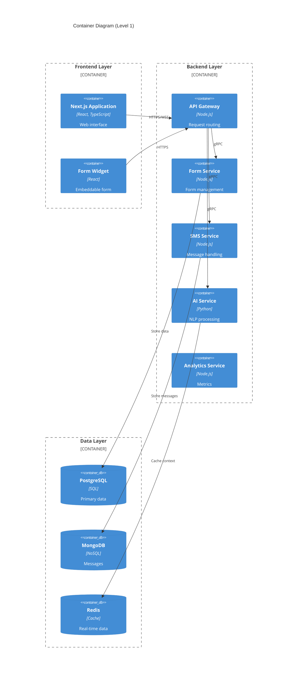

## 2.2 Component Details

### 2.2.1 Frontend Components

| Component | Details |
|-----------|---------|
| Next.js Application | - Server-side rendering for performance<br>- TypeScript for type safety<br>- Material UI components<br>- Redux state management<br>- WebSocket for real-time updates |
| Form Widget | - Standalone React component<br>- Self-contained styling<br>- Cross-origin support<br>- Minimal dependencies |

### 2.2.2 Backend Services

| Service | Technologies | Responsibilities |
|---------|--------------|------------------|
| API Gateway | - Node.js/Express<br>- Kong Gateway | - Request routing<br>- Rate limiting<br>- Authentication<br>- Load balancing |
| Form Service | - Node.js<br>- TypeScript | - Form CRUD operations<br>- Validation logic<br>- Widget embedding |
| SMS Service | - Node.js<br>- Bull Queue | - Provider integration<br>- Message queuing<br>- Delivery tracking |
| AI Service | - Python<br>- FastAPI | - NLP processing<br>- Context management<br>- Response generation |

### 2.2.3 Data Storage

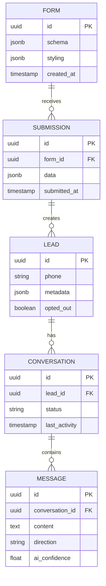

## 2.3 Technical Decisions

### 2.3.1 Architecture Patterns

| Pattern | Justification |
|---------|---------------|
| Microservices | - Independent scaling<br>- Technology flexibility<br>- Isolated failures<br>- Easier maintenance |
| Event-Driven | - Asynchronous processing<br>- Loose coupling<br>- Better scalability |
| CQRS | - Separated read/write paths<br>- Optimized queries<br>- Better performance |

### 2.3.2 Communication Patterns

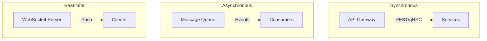

## 2.4 Cross-Cutting Concerns

### 2.4.1 Monitoring & Observability

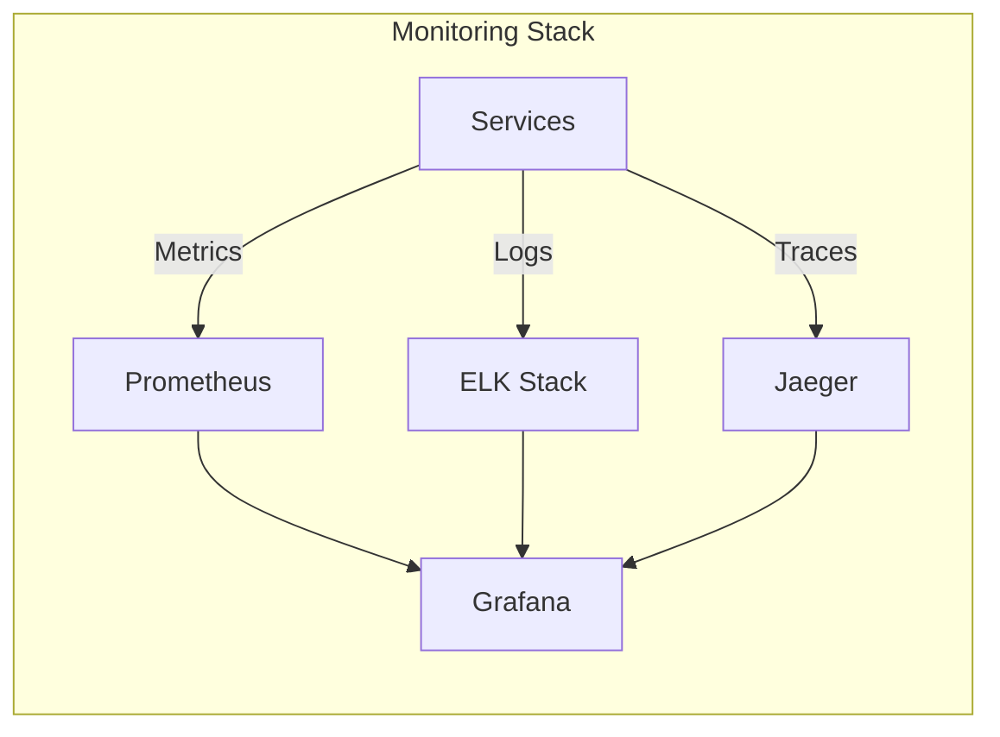

### 2.4.2 Security Architecture

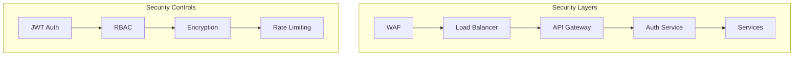

### 2.4.3 Deployment Architecture

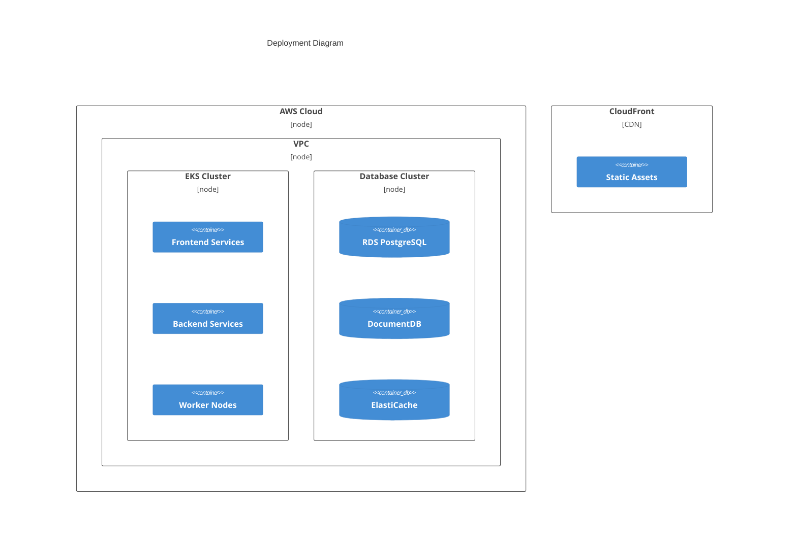

# 3. SYSTEM COMPONENTS ARCHITECTURE

## 3.1 User Interface Design

### 3.1.1 Design System Specifications

| Component | Specification |
|-----------|--------------|
| Typography | - Primary: Inter<br>- Secondary: SF Pro<br>- Heading Sizes: 48/32/24/20/16px<br>- Body Text: 16/14px |
| Color Palette | - Primary: #2563EB<br>- Secondary: #3B82F6<br>- Success: #10B981<br>- Error: #EF4444<br>- Neutral: #1F2937 |
| Spacing System | - Base Unit: 4px<br>- Scale: 4/8/12/16/24/32/48px<br>- Container Max-Width: 1280px |
| Breakpoints | - Mobile: 320px<br>- Tablet: 768px<br>- Desktop: 1024px<br>- Wide: 1280px |
| Accessibility | - WCAG 2.1 Level AA<br>- Minimum Contrast 4.5:1<br>- Focus Indicators<br>- Screen Reader Support |

### 3.1.2 Interface Components

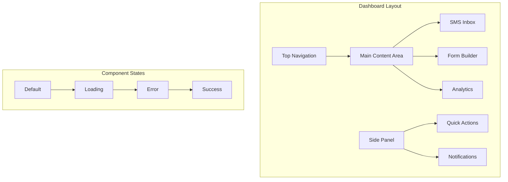

### 3.1.3 Critical User Flows

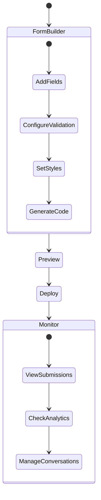

## 3.2 Database Design

### 3.2.1 Schema Design

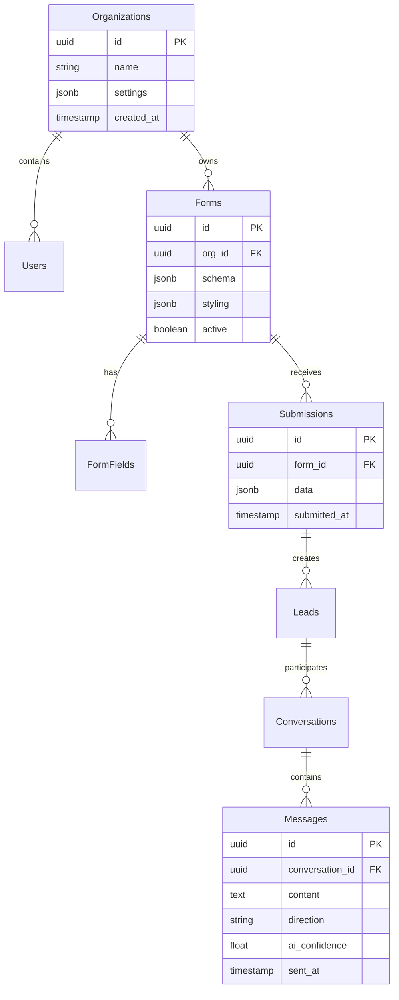

### 3.2.2 Data Management Strategy

| Aspect | Strategy |
|--------|----------|
| Partitioning | - Time-based partitioning for messages<br>- Organization-based sharding for forms<br>- Hash partitioning for users |
| Indexing | - B-tree indexes for primary keys<br>- GiST indexes for JSON fields<br>- Partial indexes for active records |
| Caching | - Redis for session data<br>- Materialized views for analytics<br>- Query result cache for forms |
| Backup | - Daily full backups<br>- Continuous WAL archiving<br>- Cross-region replication |

## 3.3 API Design

### 3.3.1 API Architecture

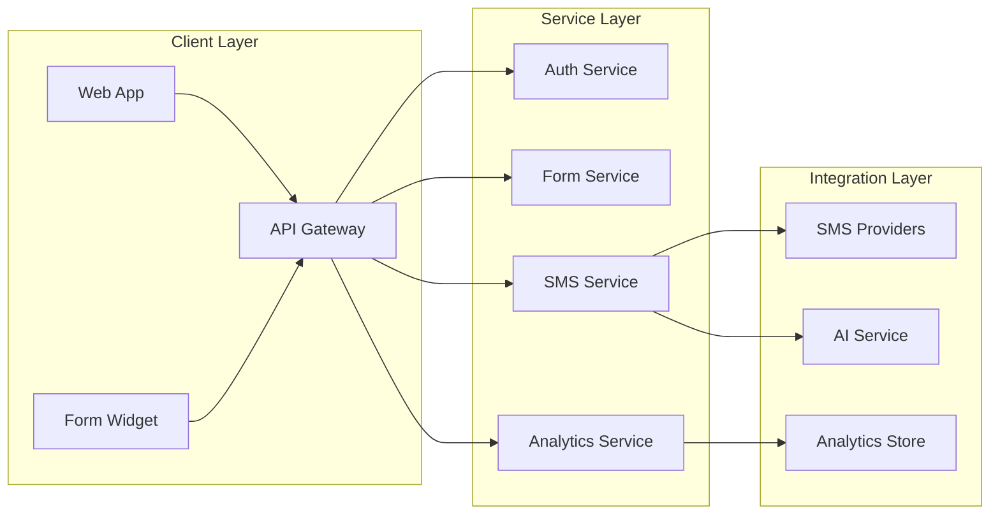

### 3.3.2 API Specifications

| Endpoint | Method | Purpose | Auth |
|----------|--------|---------|------|
| /api/v1/forms | POST | Create form | JWT |
| /api/v1/forms/{id}/submissions | POST | Submit form | Public |
| /api/v1/conversations | GET | List conversations | JWT |
| /api/v1/messages | POST | Send message | JWT |
| /api/v1/analytics | GET | Retrieve analytics | JWT |

### 3.3.3 Integration Patterns

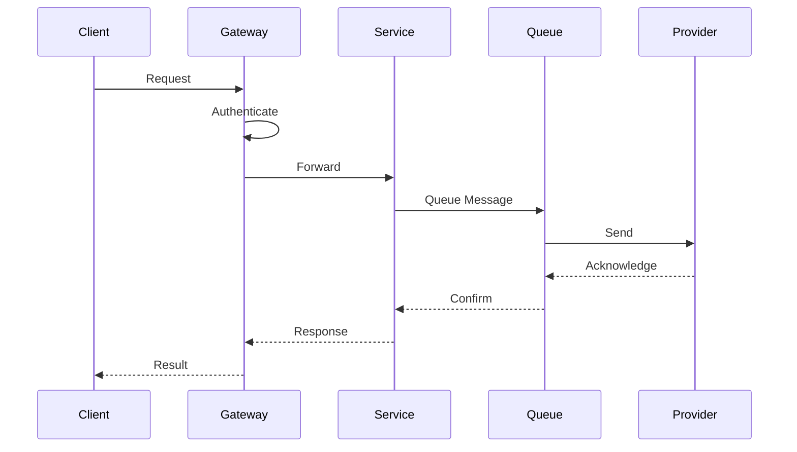

# 4. TECHNOLOGY STACK

## 4.1 PROGRAMMING LANGUAGES

| Platform/Component | Language | Version | Justification |
|-------------------|----------|---------|---------------|
| Frontend | TypeScript | 5.0+ | - Strong typing for complex form builder<br>- Enhanced IDE support<br>- Better maintainability for large codebase |
| Backend Services | Node.js | 20 LTS | - Consistent language across stack<br>- Excellent async handling for SMS operations<br>- Rich ecosystem for messaging |
| AI Service | Python | 3.11+ | - Superior ML/NLP library support<br>- Optimal for AI processing<br>- LangChain compatibility |
| Build Tools | Go | 1.21+ | - Fast compilation for CI/CD<br>- Efficient resource usage<br>- Cross-platform support |

## 4.2 FRAMEWORKS & LIBRARIES

### Core Frameworks

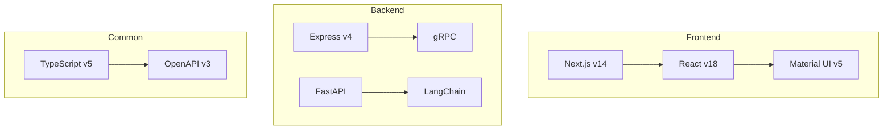

| Framework | Purpose | Justification |
|-----------|---------|---------------|
| Next.js 14 | Frontend Framework | - Server-side rendering for SEO<br>- Built-in API routes<br>- Optimized build system |
| Express 4 | API Services | - Mature ecosystem<br>- Middleware support<br>- Easy SMS provider integration |
| FastAPI | AI Service | - High performance for AI operations<br>- Native async support<br>- OpenAPI documentation |
| LangChain | AI Framework | - LLM integration<br>- Conversation management<br>- Context handling |

## 4.3 DATABASES & STORAGE

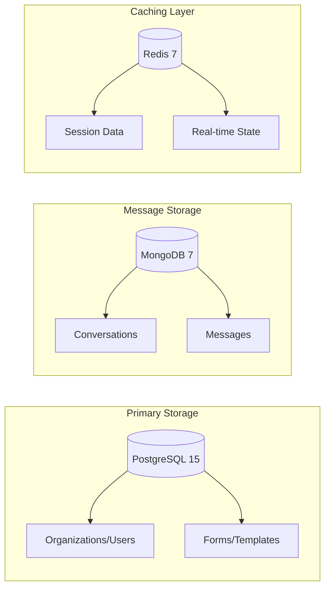

| Storage Type | Technology | Purpose |
|--------------|------------|----------|
| Primary Database | PostgreSQL 15 | - Structured data (users, forms)<br>- ACID compliance<br>- Complex queries |
| Document Store | MongoDB 7 | - Message history<br>- Conversation threads<br>- Form submissions |
| Cache Layer | Redis 7 | - Session management<br>- Real-time data<br>- Rate limiting |
| Object Storage | S3 | - Form assets<br>- Export files<br>- Backup storage |

## 4.4 THIRD-PARTY SERVICES

| Category | Service | Purpose |
|----------|---------|----------|
| SMS Providers | - Twilio<br>- MessageBird | - Message delivery<br>- Number management<br>- Delivery tracking |
| AI Services | - OpenAI GPT-4<br>- Azure OpenAI | - Natural language processing<br>- Response generation<br>- Intent classification |
| Authentication | - Auth0<br>- AWS Cognito | - User authentication<br>- SSO integration<br>- Role management |
| Monitoring | - DataDog<br>- Sentry | - Application monitoring<br>- Error tracking<br>- Performance metrics |

## 4.5 DEVELOPMENT & DEPLOYMENT

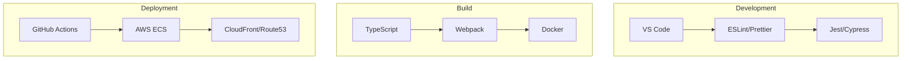

### Development Tools

| Category | Tools | Purpose |
|----------|-------|---------|
| IDE | VS Code | - TypeScript support<br>- Debug capabilities<br>- Extension ecosystem |
| Code Quality | - ESLint<br>- Prettier<br>- Husky | - Code standards<br>- Format enforcement<br>- Pre-commit hooks |
| Testing | - Jest<br>- Cypress<br>- k6 | - Unit testing<br>- E2E testing<br>- Load testing |

### Deployment Infrastructure

| Layer | Technology | Purpose |
|-------|------------|----------|
| Containerization | - Docker<br>- Docker Compose | - Service isolation<br>- Development parity<br>- Deployment consistency |
| Orchestration | - AWS ECS<br>- AWS Fargate | - Container management<br>- Auto-scaling<br>- Service discovery |
| CI/CD | - GitHub Actions<br>- AWS CodePipeline | - Automated testing<br>- Deployment automation<br>- Environment management |

# 5. SYSTEM DESIGN

## 5.1 User Interface Design

### 5.1.1 Dashboard Layout

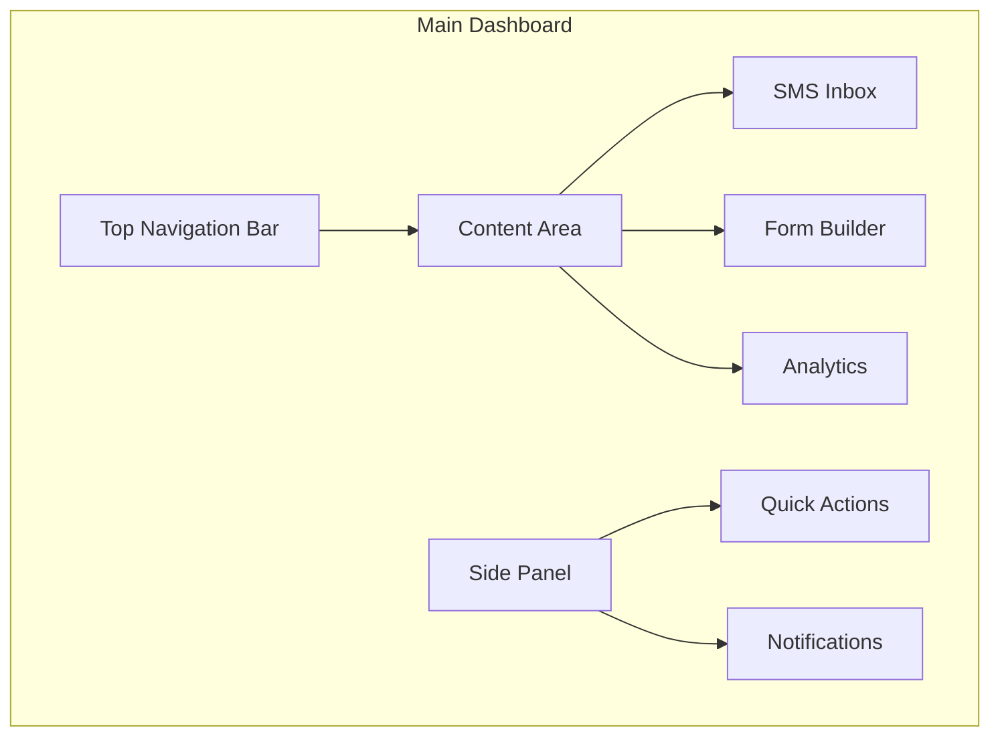

| Component | Description | Functionality |
|-----------|-------------|---------------|
| Top Navigation | - Organization switcher<br>- Main menu<br>- User profile<br>- Theme toggle | - Global navigation<br>- Account settings<br>- Dark/light mode |
| SMS Inbox | - Conversation list<br>- Thread view<br>- AI confidence indicators | - Message management<br>- Human takeover<br>- Quick replies |
| Form Builder | - Field palette<br>- Canvas area<br>- Properties panel | - Drag-and-drop<br>- Live preview<br>- Code generation |
| Analytics | - Key metrics<br>- Charts/graphs<br>- Date filters | - Data visualization<br>- Export options<br>- Custom reports |

### 5.1.2 Form Widget Interface

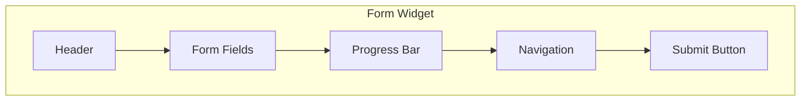

| Element | Specifications |
|---------|----------------|
| Header | - Logo placement<br>- Title/description<br>- Custom branding |
| Form Fields | - Input validation<br>- Error states<br>- Help text |
| Navigation | - Next/Previous<br>- Save progress<br>- Cancel action |
| Submit | - Loading state<br>- Success message<br>- Error handling |

## 5.2 Database Design

### 5.2.1 Schema Structure

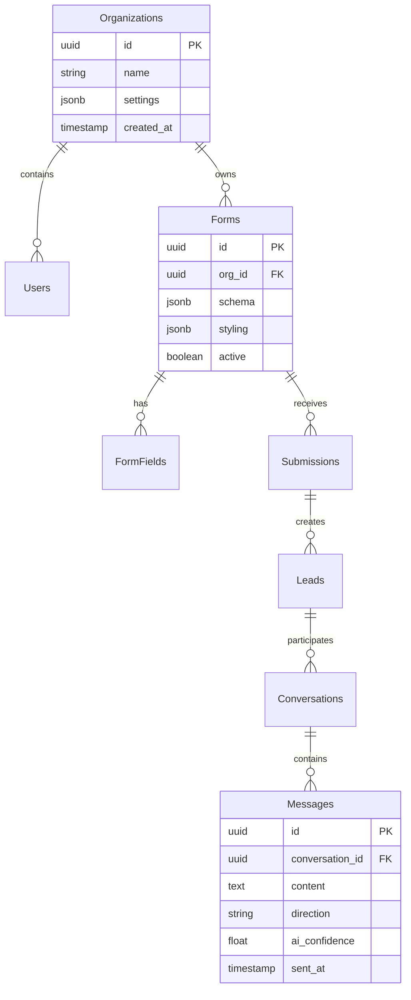

### 5.2.2 Storage Strategy

| Store Type | Purpose | Technology |
|------------|---------|------------|
| Primary DB | - User data<br>- Forms<br>- Organizations | PostgreSQL 15 |
| Document Store | - Messages<br>- Form submissions | MongoDB 7 |
| Cache Layer | - Session data<br>- Form responses<br>- AI context | Redis 7 |

## 5.3 API Design

### 5.3.1 REST Endpoints

| Endpoint | Method | Purpose | Auth |
|----------|--------|---------|------|
| `/api/v1/forms` | POST | Create form | JWT |
| `/api/v1/forms/{id}/submissions` | POST | Submit form | Public |
| `/api/v1/conversations` | GET | List conversations | JWT |
| `/api/v1/messages` | POST | Send message | JWT |
| `/api/v1/analytics` | GET | Retrieve analytics | JWT |

### 5.3.2 WebSocket Events

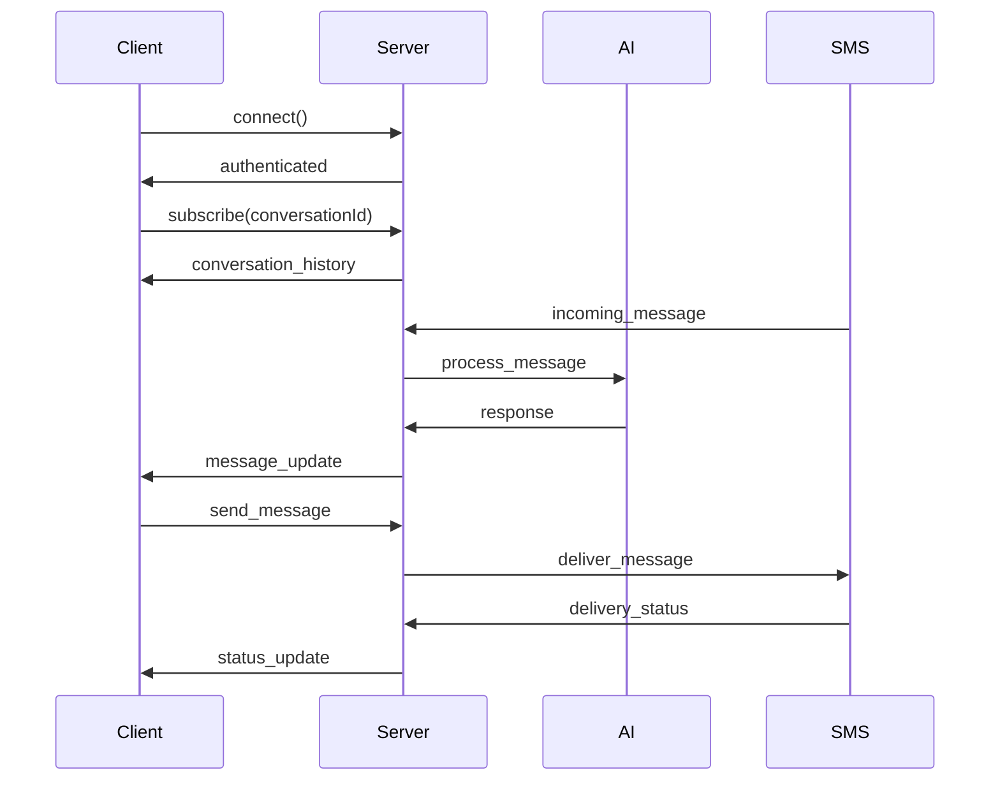

### 5.3.3 Integration Interfaces

| Interface | Protocol | Format | Authentication |
|-----------|----------|--------|----------------|
| SMS Providers | REST/HTTP | JSON | API Key |
| AI Services | gRPC | Protobuf | OAuth 2.0 |
| Analytics | REST/HTTP | JSON | Bearer Token |
| Webhooks | HTTP POST | JSON | HMAC |

### 5.3.4 Error Handling

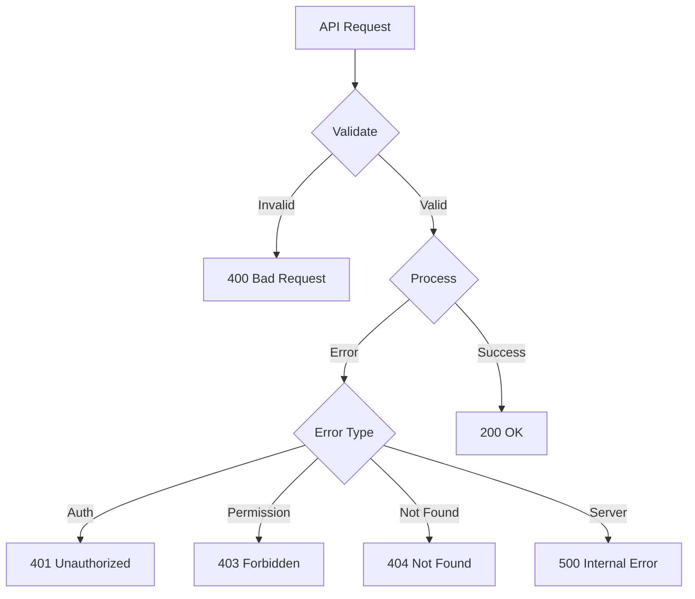

# 6. USER INTERFACE DESIGN

## 6.1 Design System

### 6.1.1 Component Key
```
Icons:                UI Elements:
[?] Help              [ ] Checkbox
[$] Payment           ( ) Radio
[i] Info             [...] Text Input
[+] Add              [Button] Button
[x] Close            [v] Dropdown
[<] [>] Navigate     [====] Progress
[^] Upload           {Tab} Active Tab
[#] Menu             {-Tab-} Inactive
[@] Profile          
[!] Alert            
[=] Settings         
[*] Favorite         
```

### 6.1.2 Layout Grid
```
+--------------------------------------------------+
|                   1280px max                      |
|  +----------------+   +-------------------------+ |
|  |   260px       |   |                         | |
|  |   Sidebar     |   |      Content Area       | |
|  |               |   |                         | |
|  +----------------+   +-------------------------+ |
+--------------------------------------------------+
```

## 6.2 Main Dashboard

```
+--------------------------------------------------+
| [#] AI-SMS Platform             [@] Admin    [=]  |
+--------------------------------------------------+
| +---------------+  +----------------------------+ |
| | [#] Dashboard |  | Active Conversations (24)  | |
| | [*] Inbox     |  +----------------------------+ |
| | [^] Forms     |  | [i] John Doe              | |
| | [$] Billing   |  | Last msg: 5 mins ago      | |
| | [=] Settings  |  | AI Confidence: [====--] 80%| |
| +---------------+  +----------------------------+ |
|                   | [!] Sarah Smith            | |
|                   | Last msg: 2 mins ago       | |
|                   | Human Agent: @Mike         | |
|                   +----------------------------+ |
+--------------------------------------------------+
```

## 6.3 Form Builder Interface

```
+--------------------------------------------------+
| Form Builder                    [Preview] [Save]  |
+--------------------------------------------------+
| +---------------+  +----------------------------+ |
| | Form Elements |  | Contact Form               | |
| | +------------+|  +----------------------------+ |
| | |[+] Text    ||  | Name:                     | |
| | |[+] Email   ||  | [.........................] | |
| | |[+] Phone   ||  |                          | |
| | |[+] Select  ||  | Email:                    | |
| | |[+] Button  ||  | [.........................] | |
| | +------------+|  |                          | |
| |              |  | Phone:                    | |
| | Properties   |  | [.........................] | |
| | +------------+|  |                          | |
| | |Required: [ ]||  | [    Submit Form    ]    | |
| | |Label: [...] ||  |                          | |
| | +------------+|  +----------------------------+ |
| +---------------+                                |
+--------------------------------------------------+
```

## 6.4 Conversation Interface

```
+--------------------------------------------------+
| Conversation with: John Doe    [Take Over] [End]  |
+--------------------------------------------------+
| +---------------+  +----------------------------+ |
| | Details       |  | Today, 2:23 PM             | |
| | Phone:        |  | > Hi, I'm interested in... | |
| | +------------+|  |                            | |
| | |555-0123    ||  | Today, 2:24 PM             | |
| | +------------+|  | < Thanks for reaching out!  | |
| |              |  | < How can I assist you?     | |
| | Source:       |  |                            | |
| | +------------+|  | Today, 2:25 PM             | |
| | |Contact Form ||  | > I'd like to know more... | |
| | +------------+|  |                            | |
| |              |  +----------------------------+ |
| | AI Status:    |  | Reply as:                  | |
| | [====--] 80%  |  | (•) AI  ( ) Human         | |
| +---------------+  | [.........................] | |
|                   | [    Send Message    ]      | |
+--------------------------------------------------+
```

## 6.5 Analytics Dashboard

```
+--------------------------------------------------+
| Analytics Overview             [Export] [Filter]   |
+--------------------------------------------------+
| +------------------+  +----------------------+     |
| | Lead Conversion  |  | Response Time        |    |
| | [=========] 90%  |  | [=======--] 85%      |    |
| +------------------+  +----------------------+     |
| | +---------------+   +----------------------+     |
| | | Daily Stats   |   | AI Performance       |    |
| | | Forms: 145    |   | Accuracy: 92%        |    |
| | | Messages: 832 |   | Handoffs: 8%         |    |
| | | Leads: 67     |   | Avg Response: 1.2s   |    |
| | +---------------+   +----------------------+     |
| +--------------------------------------------------+
```

## 6.6 Mobile Responsive Layout

```
+------------------+
| [#] AI-SMS    [@]|
+------------------+
| {Inbox} {-Form-} |
+------------------+
| Active Chats (5) |
| +---------------+|
| |John Doe [80%] ||
| |2 mins ago     ||
| +---------------+|
| |Sarah S. [!]   ||
| |5 mins ago     ||
| +---------------+|
+------------------+
| [Inbox] [Form] [#]|
+------------------+
```

## 6.7 Navigation Flows

```mermaid
flowchart TD
    A[Dashboard] --> B[Inbox]
    A --> C[Form Builder]
    A --> D[Analytics]
    B --> E[Conversation]
    E --> F[Take Over]
    E --> G[End Chat]
    C --> H[Preview]
    C --> I[Deploy]
    D --> J[Export]
```

# 7. SECURITY CONSIDERATIONS

## 7.1 Authentication and Authorization

### 7.1.1 Authentication Methods

| Method | Implementation | Use Case |
|--------|----------------|-----------|
| JWT Tokens | - Access tokens (1hr expiry)<br>- Refresh tokens (7 days)<br>- Signature using RS256 | API authentication |
| OAuth 2.0 | - Authorization code flow<br>- PKCE extension<br>- Supported providers: Google, Microsoft | SSO integration |
| MFA | - Time-based OTP<br>- SMS verification<br>- Authenticator apps | Account security |
| API Keys | - Prefix-based identification<br>- Rate limiting per key<br>- Automatic rotation | Form widget auth |

### 7.1.2 Authorization Model

```mermaid
flowchart TD
    A[User Request] --> B{Authentication}
    B -->|Valid| C{Role Check}
    B -->|Invalid| D[401 Unauthorized]
    C -->|Authorized| E[Access Granted]
    C -->|Unauthorized| F[403 Forbidden]
    
    subgraph Roles
    G[Admin] --> H[Manager]
    H --> I[Agent]
    I --> J[Read Only]
    end
```

| Role | Permissions |
|------|------------|
| Admin | - Full system access<br>- User management<br>- Security settings |
| Manager | - Team management<br>- Template creation<br>- Analytics access |
| Agent | - Conversation management<br>- Form creation<br>- Basic reporting |
| Read Only | - View conversations<br>- View analytics<br>- No modifications |

## 7.2 Data Security

### 7.2.1 Encryption Standards

```mermaid
flowchart LR
    subgraph Data at Rest
    A[AES-256-GCM] --> B[Database]
    C[Field-level Encryption] --> D[PII Data]
    end
    
    subgraph Data in Transit
    E[TLS 1.3] --> F[API Calls]
    G[WSS] --> H[Real-time Data]
    end
```

### 7.2.2 Data Protection Measures

| Layer | Protection Measure |
|-------|-------------------|
| Application | - Input sanitization<br>- XSS prevention<br>- CSRF tokens |
| Database | - Encrypted backups<br>- Access logging<br>- Query parameterization |
| Network | - WAF rules<br>- DDoS protection<br>- IP whitelisting |
| Infrastructure | - VPC isolation<br>- Security groups<br>- Network ACLs |

## 7.3 Security Protocols

### 7.3.1 Security Standards Compliance

| Standard | Implementation |
|----------|----------------|
| OWASP Top 10 | - Regular security audits<br>- Automated vulnerability scanning<br>- Security-focused code reviews |
| GDPR | - Data minimization<br>- Right to erasure support<br>- Privacy by design |
| SOC 2 | - Access controls<br>- Audit logging<br>- Security monitoring |
| PCI DSS | - Secure card data handling<br>- Regular security assessments<br>- Incident response plan |

### 7.3.2 Security Monitoring

```mermaid
flowchart TD
    A[Security Events] --> B{SIEM System}
    B --> C[Log Analysis]
    B --> D[Threat Detection]
    B --> E[Compliance Monitoring]
    
    C --> F[Alert Generation]
    D --> F
    E --> F
    
    F --> G[Security Team]
    F --> H[Automated Response]
```

### 7.3.3 Incident Response

| Phase | Actions |
|-------|---------|
| Detection | - Real-time monitoring<br>- Automated alerts<br>- User reporting |
| Containment | - Account suspension<br>- API key revocation<br>- Network isolation |
| Eradication | - Vulnerability patching<br>- System hardening<br>- Security updates |
| Recovery | - Service restoration<br>- Data verification<br>- System monitoring |
| Review | - Incident analysis<br>- Process improvement<br>- Documentation update |

### 7.3.4 Security Testing

| Test Type | Frequency | Scope |
|-----------|-----------|-------|
| Penetration Testing | Quarterly | - External interfaces<br>- Authentication systems<br>- API endpoints |
| Vulnerability Scanning | Weekly | - Infrastructure<br>- Dependencies<br>- Configuration |
| Security Reviews | Monthly | - Code changes<br>- Access controls<br>- Security configs |
| Compliance Audits | Annually | - Standards compliance<br>- Policy adherence<br>- Documentation |

# 8. INFRASTRUCTURE

## 8.1 DEPLOYMENT ENVIRONMENT

```mermaid
flowchart TD
    subgraph Production
    A[AWS Cloud] --> B[Multi-AZ Deployment]
    B --> C[Primary Region: us-east-1]
    B --> D[DR Region: us-west-2]
    end
    
    subgraph Staging
    E[AWS Cloud] --> F[Single-AZ Deployment]
    F --> G[Region: us-east-2]
    end
    
    subgraph Development
    H[Local Environment] --> I[Docker Compose]
    H --> J[Minikube]
    end
```

| Environment | Configuration | Purpose |
|-------------|--------------|----------|
| Production | Multi-AZ, Multi-Region | High availability production workloads |
| Staging | Single-AZ, Single-Region | Pre-production testing and validation |
| Development | Local/Containerized | Development and testing |
| DR | Cross-Region | Business continuity |

## 8.2 CLOUD SERVICES

| Service | Purpose | Justification |
|---------|---------|---------------|
| AWS EKS | Container Orchestration | - Managed Kubernetes service<br>- Auto-scaling capabilities<br>- Multi-AZ support |
| AWS RDS | PostgreSQL Database | - Automated backups<br>- Multi-AZ failover<br>- Managed updates |
| AWS DocumentDB | MongoDB Compatible | - Scalable document storage<br>- Compatible with MongoDB drivers<br>- Managed service |
| AWS ElastiCache | Redis Cache | - In-memory caching<br>- Session management<br>- Real-time data |
| AWS S3 | Object Storage | - Form assets storage<br>- Backup retention<br>- Static file hosting |
| AWS CloudFront | CDN | - Global content delivery<br>- Edge caching<br>- SSL/TLS termination |
| AWS Route53 | DNS Management | - Global DNS routing<br>- Health checking<br>- Failover configuration |

## 8.3 CONTAINERIZATION

```mermaid
flowchart LR
    subgraph Container Architecture
    A[Base Images] --> B[Service Images]
    B --> C[Development]
    B --> D[Production]
    end
    
    subgraph Base Images
    E[node:20-alpine] --> F[Frontend]
    E --> G[Backend]
    H[python:3.11-slim] --> I[AI Service]
    end
```

| Component | Base Image | Configuration |
|-----------|------------|---------------|
| Frontend | node:20-alpine | - Next.js application<br>- Nginx for static serving<br>- Multi-stage build |
| Backend Services | node:20-alpine | - Node.js services<br>- PM2 process manager<br>- Health monitoring |
| AI Service | python:3.11-slim | - FastAPI application<br>- ML dependencies<br>- Model serving |
| Redis | redis:7-alpine | - Cache configuration<br>- Persistence setup<br>- Cluster mode |

## 8.4 ORCHESTRATION

```mermaid
flowchart TD
    subgraph EKS Cluster
    A[Ingress Controller] --> B[Service Mesh]
    B --> C[Application Services]
    B --> D[Background Workers]
    end
    
    subgraph Services
    C --> E[Frontend Pods]
    C --> F[Backend Pods]
    C --> G[AI Service Pods]
    end
    
    subgraph Storage
    H[(EBS Volumes)] --> I[Persistent Storage]
    J[(S3 Buckets)] --> K[Object Storage]
    end
```

| Component | Configuration | Purpose |
|-----------|--------------|----------|
| EKS Cluster | - Multi-AZ deployment<br>- Auto-scaling groups<br>- Spot instances | Primary orchestration platform |
| Service Mesh | - AWS App Mesh<br>- Service discovery<br>- Traffic management | Service communication |
| Ingress | - AWS ALB Ingress<br>- SSL termination<br>- Path-based routing | External access |
| Auto-scaling | - HPA for pods<br>- VPA for resources<br>- Cluster auto-scaler | Resource optimization |

## 8.5 CI/CD PIPELINE

```mermaid
flowchart LR
    subgraph CI Pipeline
    A[GitHub] --> B[GitHub Actions]
    B --> C[Build]
    C --> D[Test]
    D --> E[Security Scan]
    E --> F[Package]
    end
    
    subgraph CD Pipeline
    F --> G[AWS ECR]
    G --> H[ArgoCD]
    H --> I[Development]
    I --> J[Staging]
    J --> K[Production]
    end
```

| Stage | Tools | Purpose |
|-------|-------|---------|
| Source Control | GitHub | - Version control<br>- Code review<br>- Branch protection |
| CI | GitHub Actions | - Automated builds<br>- Unit/Integration tests<br>- Security scanning |
| Artifact Storage | AWS ECR | - Container registry<br>- Image scanning<br>- Version tagging |
| CD | ArgoCD | - GitOps deployment<br>- Configuration management<br>- Rollback capability |
| Monitoring | - Prometheus<br>- Grafana<br>- ELK Stack | - Metrics collection<br>- Visualization<br>- Log aggregation |

### Deployment Process

| Environment | Trigger | Validation |
|------------|---------|------------|
| Development | Push to feature branch | - Automated tests<br>- Code quality checks |
| Staging | Merge to develop | - Integration tests<br>- Performance tests |
| Production | Release tag | - Smoke tests<br>- Canary deployment |

# 8. APPENDICES

## 8.1 Additional Technical Information

### Development Environment Setup

```mermaid
flowchart TD
    A[Local Development] --> B[Docker Compose]
    B --> C[Frontend Container]
    B --> D[Backend Services]
    B --> E[Databases]
    
    subgraph Services
    D --> F[Form Service]
    D --> G[SMS Service]
    D --> H[AI Service]
    end
    
    subgraph Data Layer
    E --> I[(PostgreSQL)]
    E --> J[(MongoDB)]
    E --> K[(Redis)]
    end
```

| Component | Configuration |
|-----------|--------------|
| Node.js | v20 LTS with npm workspaces |
| Python | v3.11 with virtualenv |
| Docker | Latest stable with BuildKit |
| Git | Latest with Husky hooks |
| IDE | VS Code with recommended extensions |

### Performance Benchmarks

| Metric | Target | Measurement Method |
|--------|--------|-------------------|
| Form Load Time | < 1s | Lighthouse Performance Score |
| SMS Processing | < 500ms | Server-side timing |
| AI Response | < 1s | End-to-end latency |
| API Latency | < 100ms | p95 response time |

## 8.2 Glossary

| Term | Definition |
|------|------------|
| Webhook | HTTP callback that delivers real-time information to other applications |
| Circuit Breaker | Design pattern that prevents cascading failures in distributed systems |
| Dark Mode | UI color scheme using darker colors to reduce eye strain |
| Form Widget | Embeddable component for collecting user information on websites |
| Lead Scoring | Process of ranking leads based on their likelihood to convert |
| Message Queue | System that handles message processing and delivery in order |
| Rate Limiting | Controlling the number of requests a user can make to an API |
| Thread | Continuous conversation between system and lead via SMS |
| Webhook | HTTP callback for real-time information delivery |
| Zero Trust | Security model that requires verification for all access attempts |

## 8.3 Acronyms

| Acronym | Full Form |
|---------|-----------|
| API | Application Programming Interface |
| CCPA | California Consumer Privacy Act |
| CDN | Content Delivery Network |
| CQRS | Command Query Responsibility Segregation |
| CRUD | Create, Read, Update, Delete |
| DDoS | Distributed Denial of Service |
| GDPR | General Data Protection Regulation |
| gRPC | Google Remote Procedure Call |
| HMAC | Hash-based Message Authentication Code |
| IDE | Integrated Development Environment |
| JWT | JSON Web Token |
| LLM | Large Language Model |
| MFA | Multi-Factor Authentication |
| NLP | Natural Language Processing |
| OWASP | Open Web Application Security Project |
| PII | Personally Identifiable Information |
| RBAC | Role-Based Access Control |
| REST | Representational State Transfer |
| SaaS | Software as a Service |
| SDK | Software Development Kit |
| SMS | Short Message Service |
| SOC | System and Organization Controls |
| SQL | Structured Query Language |
| SSO | Single Sign-On |
| TCPA | Telephone Consumer Protection Act |
| TLS | Transport Layer Security |
| UI/UX | User Interface/User Experience |
| VPC | Virtual Private Cloud |
| WAF | Web Application Firewall |
| WCAG | Web Content Accessibility Guidelines |
| WSS | WebSocket Secure |
| XSS | Cross-Site Scripting |